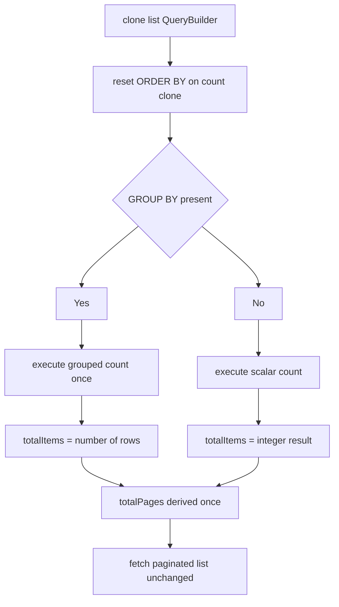
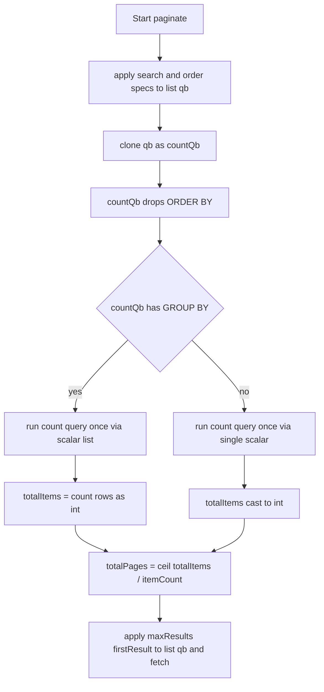

# Design Document — hotfix/paginatorCountFixes (research Option A)

## Overview
**Purpose**: This feature makes the row-count query built during pagination cheaper and deterministic: the count never executes ORDER BY sorting, and grouped queries execute the count exactly once. It delivers this to every consumer of the package without any call-site change.
**Users**: Screen developers in the consuming application (hundreds of paginated screens) benefit through faster page loads and stable totals; integrators upgrade the package without code changes.
**Impact**: Changes the current count construction inside `Paginator::paginate()` — the count clone drops its ORDER BY part, and the exception-driven double execution is replaced by an explicit grouped/non-grouped branch. List query behavior, hydration, and the public API are untouched.

### Goals
- Count query carries no ORDER BY (requirement 1.1) while the list query keeps all order specs (1.2)
- Exactly one count execution per pagination run for grouped and non-grouped queries (2.1)
- Totals identical to the previous release for non-row-multiplying screens (1.3, 2.3)
- Predictable integer totals, including empty result sets (3.1–3.3, 4.1–4.3)
- Zero public API changes and zero new dependencies (5.1)

### Non-Goals
- Count result caching (`setCountCache()`, psr/simple-cache) — deferred spec
- Distinct counting for row-multiplying 1:n joins (`distinctCount` flag) — deferred spec
- Application-side conditional-join reduction (crash doc 10)
- Changing the existing `COUNT('alias')` expression style or any list-fetch/hydration behavior

## Boundary Commitments

### This Spec Owns
- Construction and execution of the count query inside `Paginator::paginate()`
- The count branching rule: grouped (one row per group → total = number of groups) vs non-grouped (scalar total)
- The bookkeeping contract of `totalItems` / `totalPages` after a successful pagination run
- Failure semantics of the count step (no swallowed exceptions)

### Out of Boundary
- The paginated list query: joins, WHERE, GROUP BY, ORDER BY, `setMaxResults`/`setFirstResult`, hydration — unchanged
- Count caching and cache invalidation — later spec
- `COUNT(DISTINCT …)` semantics for 1:n joins — later spec, per call site
- Consuming call sites and the application repository — must not be modified by this spec
- Search-rule processing, order-spec processing — unchanged

### Allowed Dependencies
- `doctrine/orm ^2.11` APIs already in use: `QueryBuilder` clone/`getAllAliases`/`resetDQLPart`/`getDQLPart`/`select`, `Query::getScalarResult`/`getSingleScalarResult`
- `php >=7.4` language features only
- No new runtime or dev dependencies; no changes to `composer.json`

### Revalidation Triggers
- A doctrine/orm upgrade that changes `QueryBuilder` clone semantics or `getAllAliases` ordering
- Any consumer found relying on `getTotalItems()` returning `null` (previously possible after a swallowed exception)
- A future spec introducing count caching — it must layer on top of this branching structure, not replace it silently

## Architecture

### Existing Architecture Analysis
- Single-class package; the only modification point is `Paginator::paginate()` (`src/Paginator/Paginator.php`), count block at lines 263–279
- Invariants to respect: the count clone is created **after** mandatory/user order-spec handling; the list query object is separate from the count clone, so list behavior is preserved by construction
- Technical debt removed: broad `catch (\Exception)` that silently left `totalItems` unset, and the duplicate count execution for grouped queries

### Architecture Pattern & Boundary Map

- Selected pattern: minimal in-place refactor of one method — no new components, no new layers
- Existing patterns preserved: clone-based count, `COUNT('alias')` expression style, pagination of the original `$qb`
- New components: none
- Steering compliance: stays within the package's single responsibility (pagination bookkeeping); no upstream PPA concerns leak in

### Technology Stack

| Layer | Choice / Version | Role in Feature | Notes |
|-------|------------------|-----------------|-------|
| Backend / Services | PHP >=7.4 + doctrine/orm ^2.11 | `Paginator::paginate()` count construction and branching | No new dependencies |

## File Structure Plan

### Directory Structure
```
src/Paginator/
└── Paginator.php              # modified: count block in paginate()
```

### Modified Files
- `src/Paginator/Paginator.php` — count block: (a) `resetDQLPart('orderBy')` on the count clone immediately after cloning, before alias/select; (b) replace try/catch with a `groupBy` branch that executes the count once and assigns an integer total; (c) remove the now-unused `use Doctrine\ORM\NonUniqueResultException;` import; (d) a comment at the clone marking that it must stay after order-spec handling

No other files change — `composer.json`, call sites, and list-query behavior are untouched.

## System Flows

Key decisions: the branch inspects GROUP BY **once** and never relies on exceptions for control flow; any error thrown by the count query propagates to the caller (fail fast, per requirement 3.3); `totalPages` is assigned exactly once, after the branch.

## Requirements Traceability

| Requirement | Summary | Components | Interfaces | Flows |
|-------------|---------|------------|------------|-------|
| 1.1 | Count query has no ORDER BY | Count block | CountQuery contract | Count flow step reset |
| 1.2 | List keeps all order specs | List query (untouched path) | — | Count flow step start/end |
| 1.3 | Same totals as previous release (non-multiplying joins) | Count block | Totals contract | Count flow |
| 2.1 | Exactly one count execution (grouped) | Count block | CountQuery contract | Count flow grouped branch |
| 2.2 | Total = number of groups | Count block | Totals contract | Count flow grouped branch |
| 2.3 | Same grouped totals as previous release | Count block | Totals contract | Count flow grouped branch |
| 3.1 | Empty result → 0 items / 0 pages | Count block, totalPages | Totals contract | Count flow |
| 3.2 | Empty grouped result → 0, not unset | Count block | Totals contract | Count flow grouped branch |
| 3.3 | Unexpected count errors surface | Count block | Error contract | Count flow |
| 4.1 | Integer totalItems on success | Count block | Totals contract | Count flow |
| 4.2 | totalPages derived once from items × item count | totalPages | Totals contract | Count flow step derive |
| 4.3 | 0 items → 0 pages | totalPages | Totals contract | Count flow step derive |
| 5.1 | Public API unchanged | Whole class | Public API contract | — |
| 5.2 | Same page slice and row order after upgrade | List query (untouched path) | — | Count flow step fetch |

## Components and Interfaces

| Component | Domain/Layer | Intent | Req Coverage | Key Dependencies (P0/P1) | Contracts |
|-----------|--------------|--------|--------------|--------------------------|-----------|
| Paginator count block | Pagination bookkeeping | Build and run the count query once, without sorting, with explicit grouped handling | 1.1–5.2 | doctrine/orm QueryBuilder+Query (P0) | Service, State |

### Pagination layer

#### Paginator (count block in `paginate()`)

| Field | Detail |
|-------|--------|
| Intent | Assign `totalItems`/`totalPages` from one unsorted count query per run |
| Requirements | 1.1, 1.2, 1.3, 2.1, 2.2, 2.3, 3.1, 3.2, 3.3, 4.1, 4.2, 4.3, 5.1, 5.2 |

**Responsibilities & Constraints**
- Clone the fully prepared list QueryBuilder after search and order processing; the clone is the count query
- Drop the ORDER BY part on the clone only; the list query object keeps every order part
- Choose exactly one execution path: grouped → scalar list of per-group counts, total = row count; non-grouped → single scalar result
- Keep the existing `COUNT('alias')` expression and the existing `getAllAliases()[0]` root alias assumption
- Keep `totalPages = ceil(totalItems / itemCount)` as the single post-branch assignment (float return of `ceil` is existing behavior — do not change)

**Dependencies**
- Inbound: `PaginatableQueryInterface` — provides prefix, QueryBuilder, hydrator (P0)
- Outbound: doctrine/orm `QueryBuilder`/`Query` — count execution (P0)
- External: none new (P2)

**Contracts**: Service [x] / State [x]

##### Service Interface
```php
public function paginate(PaginatableQueryInterface $query): self;
// unchanged signature; postconditions added:
public function getTotalItems(): int|string|null; // now always int after success
public function getTotalPages(): float;           // ceil result, existing behavior
```
- Preconditions: `$query->getQueryBuilder()` carries search/order specs after `paginate()` preparation; alias list non-empty (existing assumption)
- Postconditions: on success `getTotalItems()` returns int; count query executed at most once; count SQL contains no ORDER BY; exceptions from the count query propagate uncaught
- Invariants: list query ORDER BY, limit and offset identical to previous release; no exception used as control flow

**Implementation Notes**
- Integration: insertion point is directly after `$countQb = clone $qb;` (`src/Paginator/Paginator.php:264`) and before `$aliases = …` — the clone already happens after order-spec handling; keep that ordering with a source comment
- Validation: every acceptance criterion maps to a query-log-observable or replay-comparable check (see Testing Strategy)
- Risks: MySQL/PDO may return the scalar count as a numeric string → cast to int on both branches; grouped-count rows are 0-indexed so row count equals the old `end(); key()+1` value

## Error Handling

### Error Strategy
Fail fast: the count block performs no catching. Any exception from the count query propagates to the caller exactly as a misconfigured query would — replacing today's silent `totalItems = null` path. Empty grouped results are a normal case handled by the branch (`\count([]) = 0`), not an error.

### Error Categories and Responses
- **Query errors** (bad DQL, connection issues): propagate uncaught — caller/logging layer handles, consistent with the list query's behavior
- **Edge cases, not errors**: empty non-grouped result (scalar count returns 0); empty grouped result (zero rows → 0 groups); zero items → `totalPages` 0

### Monitoring
No package-side logging added (library stays silent); verification uses the consuming application's Doctrine SQL logger — grouped screens must show exactly one COUNT statement.

## Verification (no automated tests in this repo)

The package has no test infrastructure and this spec adds none; every acceptance criterion is verified manually and operator-observably:

1. **Query-log check** (1.1, 1.2): enable the Doctrine SQL logger in a consuming screen; the COUNT statement must contain no ORDER BY while the list statement retains the full order.
2. **Single execution** (2.1): on a grouped screen (picking-plan), the profiler query count must show exactly one COUNT per page load — previously two.
3. **Totals parity** (1.3, 2.3, 5.2): replay representative requests against the previous release and the fixed release; totals and page slices must match for 1:1-join screens and grouped screens alike.
4. **Edge cases** (3.1, 3.2, 4.1–4.3): a filter that matches nothing must yield total 0 / pages 0 (grouped and non-grouped) with `getTotalItems()` returning int.
5. **Error surfacing** (3.3): a deliberately broken order field must propagate its exception instead of silently producing an unset total.
6. **API surface** (5.1): diff the class against the previous release — public method set and signatures unchanged.

Post-deployment: re-run `analyze-slowlog.ps1` / `explain-after.sql`; COUNT entries must lose their filesort and duplicate executions.

## Performance & Scalability
- Grouped screens: count cost halves (one execution); all screens: count query no longer performs an ORDER BY filesort
- No new indexes or storage changes; join-walk reduction stays with the application-side work (out of boundary)

## Migration Strategy
Not applicable — no schema or data movement. Rollout: tag patch release, `composer update ppadevs/paginator` in the consuming app; rollback = previous package version.
